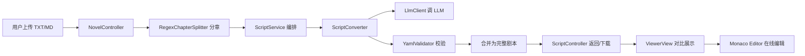

# ScriptForge — AI 小说转剧本工具

将 3 章以上的小说文本自动转换为结构化剧本（YAML 格式），让作者快速获得可编辑、可进一步打磨的剧本初稿。

[](https://openjdk.org/)
[](https://vuejs.org/)
[](LICENSE)

演示视频：[待录制]  
线上地址：[待部署]

## 核心功能

| 功能 | 说明 |
|------|------|
| 小说上传与分章 | 支持 TXT/MD，自动识别"第X章""Chapter X"等多种模式 |
| LLM 逐章转换 | 调用 DeepSeek/Qwen 将小说转为结构化 YAML 剧本（两阶段：生成 + 去 AI 味润色） |
| YAML Schema 校验 | 校验 LLM 输出是否符合 Schema，失败自动重试（最多 2 次） |
| 章节合并输出 | 多章合并为完整剧本，可下载 YAML |
| 前端对比编辑 | 左侧原文 / 右侧剧本分栏展示，Monaco Editor 在线编辑 |
| 章节选择 | 可勾选指定章节转换，不用全转 |
| 降级模式 | LLM API Key 未配时前端显示引导提示，不白屏 |

## 技术架构



## 快速开始

### 1. 获取 LLM API Key

访问 [DeepSeek 开放平台](https://platform.deepseek.com) 注册并创建 API Key（新用户有免费额度）。也可使用 [阿里云百炼](https://bailian.console.aliyun.com) 的 Qwen-Plus API。

### 2. 启动项目

```bash
git clone https://github.com/dabidai/ScriptForge.git
cd ScriptForge

# 配置环境变量
export LLM_API_KEY=你的API密钥

# 后端（端口 8080）
cd backend && mvn spring-boot:run

# 前端（端口 5173，新终端）
cd frontend && npm install && npm run dev
```

访问 http://localhost:5173 即可使用。

### 3. Docker 部署

```bash
cp .env.example .env  # 编辑填入 LLM_API_KEY
docker compose up -d
```

## 技术栈

| 层 | 技术 | 版本 |
|----|------|------|
| 后端框架 | Spring Boot | 3.2.5 |
| 语言 | Java | 17 |
| ORM | MyBatis-Plus | 3.5.7 |
| 数据库 | SQLite | 3.46 |
| LLM 调用 | Spring RestClient | - |
| YAML 处理 | Jackson YAML | 2.17 |
| 前端框架 | Vue 3 + Vite | 3.4 / 8.0 |
| 编辑器 | Monaco Editor | 0.52 |
| HTTP 客户端 | Axios | 1.7 |
| 部署 | Docker Compose | - |

## 第三方依赖

| 依赖 | 用途 | 版本 |
|------|------|------|
| spring-boot-starter-web | REST API 框架 | 3.2.5 |
| mybatis-plus-spring-boot3-starter | ORM 数据库操作 | 3.5.7 |
| sqlite-jdbc | SQLite 数据库驱动 | 3.46.1.0 |
| jackson-dataformat-yaml | YAML 序列化/反序列化 | - |
| lombok | 减少样板代码 | - |
| vue | 前端框架 | 3.4 |
| vue-router | 前端路由 | 4.3 |
| axios | HTTP 请求 | 1.7 |
| monaco-editor | 代码编辑器 | 0.52 |

功能模块：ChapterSplitter（分章引擎）、ScriptConverter（LLM 转换管道）、YamlValidator（Schema 校验）、PromptBuilder（Prompt 模板）、UploadPanel（前端上传组件）、ConvertView（转换交互）、ViewerView（对比展示）。

## API 文档

| 方法 | 路径 | 说明 |
|------|------|------|
| GET | `/api/health` | 健康检查 |
| POST | `/api/novels/upload` | 上传小说（multipart file） |
| GET | `/api/novels/by-uuid/{uuid}` | 按 UUID 查询小说 |
| GET | `/api/novels/by-uuid/{uuid}/chapters` | 查询小说章节列表 |
| POST | `/api/scripts/convert` | 开始转换 `{novelUuid, chapterNumbers?}` |
| GET | `/api/scripts/{id}` | 获取转换结果 |
| PUT | `/api/scripts/{id}/yaml` | 保存编辑后的 YAML |
| GET | `/api/scripts/{id}/yaml` | 下载 YAML 文件 |
| POST | `/api/scripts/validate` | 校验 YAML Schema |

## 项目结构

```
ScriptForge/
├── backend/                       # Spring Boot 后端
│   └── src/main/java/com/scriptforge/
│       ├── config/                # Web / Llm / MyBatis 配置
│       ├── controller/            # REST 控制器
│       ├── service/               # 业务逻辑（接口+实现）
│       ├── model/
│       │   ├── entity/            # MyBatis 实体
│       │   ├── dto/               # 请求/响应 DTO
│       │   └── schema/            # YAML Schema Java 类
│       ├── client/                # LLM API 客户端
│       ├── mapper/                # MyBatis Mapper 接口
│       └── exception/             # 全局异常处理
├── frontend/                      # Vue 3 前端
│   └── src/
│       ├── views/                 # 页面视图
│       ├── components/            # 组件
│       ├── api/                   # API 层
│       ├── types/                 # TypeScript 类型
│       └── router/                # Vue Router
├── docs/                          # 设计文档
│   └── SCHEMA_DESIGN.md           # YAML Schema 设计文档
├── docker-compose.yml
├── .env.example
└── README.md
```

## YAML Schema 设计

详见 [docs/SCHEMA_DESIGN.md](docs/SCHEMA_DESIGN.md)，包含四大顶层分块（metadata / characters / locations / episodes）、多态 content 元素、10 项设计决策理由。
